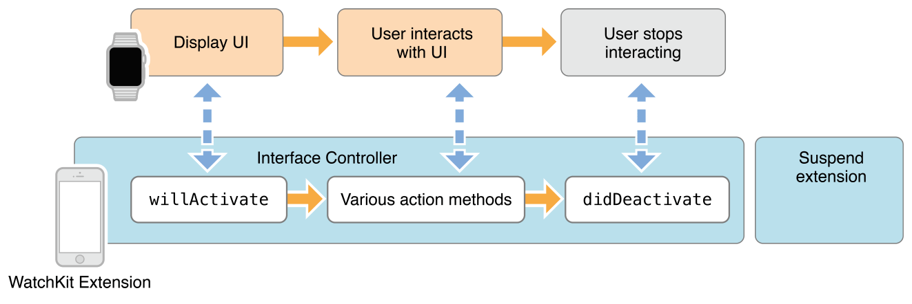

# Apple Watch

---

# Structure

---

# Arhitecture

---

# Life Cycle

---

# Life Cycle

---

# Sharing Data

- Sandbox Environment
- App Group
- NSUserDefaults
- Frameworks

---

# UI

- Vertically on different lines
- Set or update data values
- Change the size of an object
- Change the transparency of an object
- Show or hide an object

---

# Navigation

- **Page based**
	Data between pages is not closely related
	Swipe left or right
	Dot indicator

- **Hierarchical**
	Complex data model
	Root view controller

**!mix** page-based && hierarchical navigation

---

# Design

---

# Glance Essentials

Provides immediately relevant information in a timely manner
!interactivity
Automatically launches your WatchKit app.

---

# Notification Essentials

iOS decides iPhone || Apple Watch

**Short-Look**
	- Nonscrolling
	- !customized

**Long-Look**
	- Scrollable
	- Notification content
	- Action buttons

---

# Short-Look

---

# Long-Look

---

# Long-Look

---

# Notification Event Cycle

